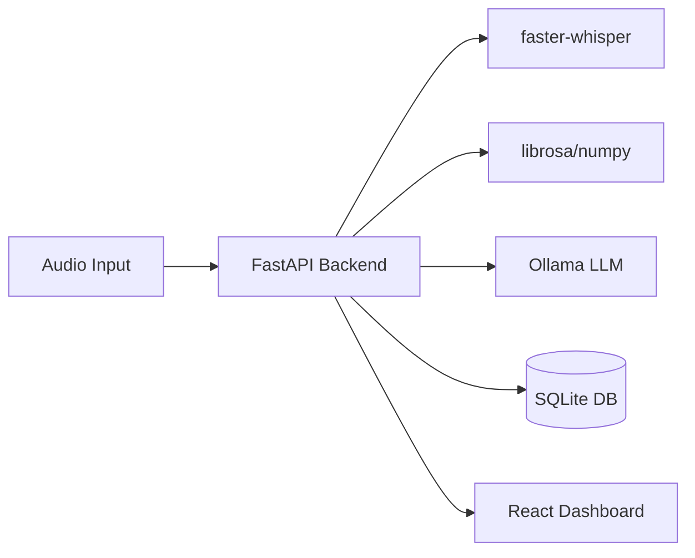

# AI Mock Interview Coach

An intelligent, local-first application designed to provide objective, data-driven feedback on interview performance. Built to help students practice communication, content structure, and delivery skills in a pressure-free, private environment.

## 🚀 Key Features

*   **100% Local Processing:** Uses `faster-whisper` for speech-to-text and `Ollama` (Llama 3.2) for semantic evaluation. No third-party API dependencies or data privacy risks.
*   **Objective Delivery Analysis:** Utilizes `librosa` and `numpy` to extract verifiable metrics like speaking rate (WPM), pause duration, and filler word counts.
*   **Full-Stack Engineering:** FastAPI backend with a robust SQLite persistence layer for session tracking.
*   **Interactive Dashboard:** Responsive React (Vite) interface featuring performance trend charts and content skill mapping (Radar charts).
*   **Testing & Reliability:** Includes a modular integration test suite for the ML pipeline.

## 🏗️ Architecture



## 🛠️ Tech Stack

*   **Frontend:** React, Vite, Recharts, CSS (Vanilla)
*   **Backend:** FastAPI, Python, Pydantic
*   **AI/ML:** faster-whisper, Ollama (Llama 3.2), librosa
*   **Database:** SQLite

## 💡 Engineering Highlights for Interviews

When asked about your work, focus on these choices:

*   **Modular Architecture:** "I structured the backend using FastAPI `APIRouter` to separate concerns, making the API extensible and easier to unit test."
*   **Data-Driven Testing:** "Since AI model outputs can be non-deterministic, I focused on schema validation in my test suite to ensure the UI always receives structured, expected data."
*   **Infrastructure Resilience:** "I solved environment-specific challenges, such as backend port conflicts, by diagnosing the issue via CLI tools and migrating services, which helped me understand the importance of configuration management."
*   **Local-First Design:** "By choosing local models, I ensured zero-cost API usage and absolute data privacy for users."

## 🏃‍♂️ Getting Started

### Prerequisites
- Python 3.10+
- Node.js 18+
- [Ollama](https://ollama.com/) installed and running with `llama3.2`

### Setup
1. **Clone the repo.**
2. **Backend:**
   ```bash
   cd backend
   pip install -r requirements.txt
   uvicorn app.api.main:app --host 0.0.0.0 --port 8080
   ```
3. **Frontend:**
   ```bash
   cd frontend
   npm install
   npm run dev
   ```

## 📈 Future Scope
- [ ] Add sentiment analysis for confidence tracking.
- [ ] Implement PDF export for interview reports.
- [ ] Add dark mode support.
